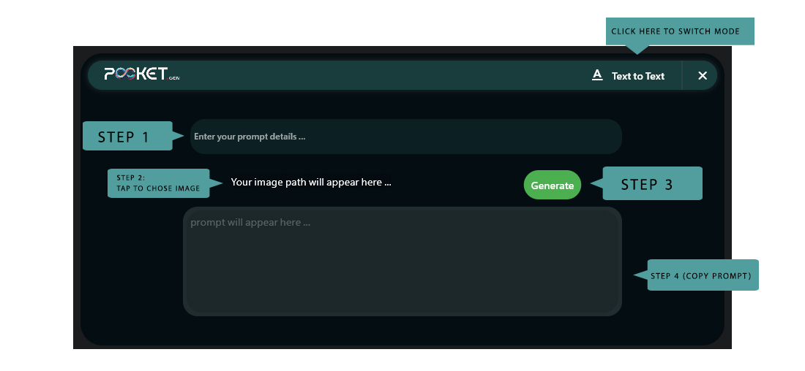
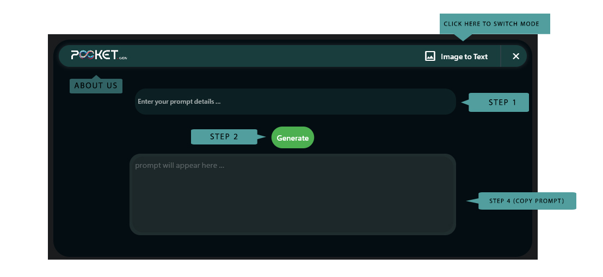
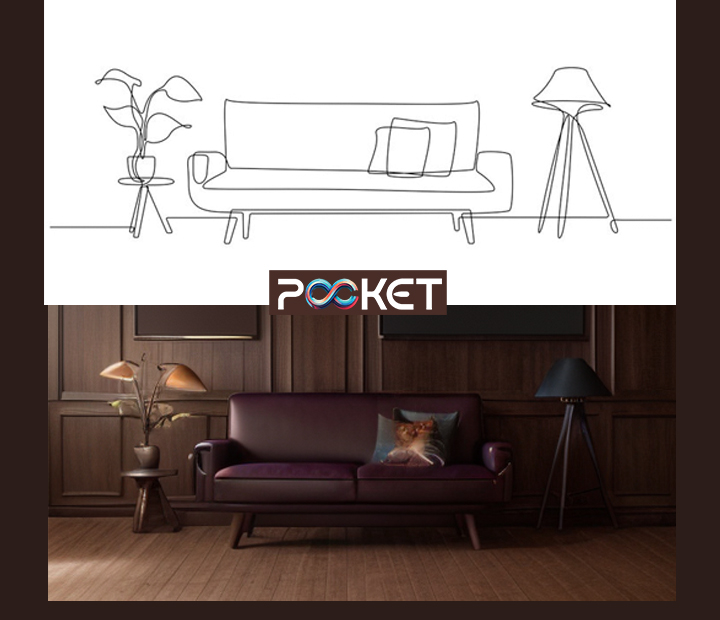
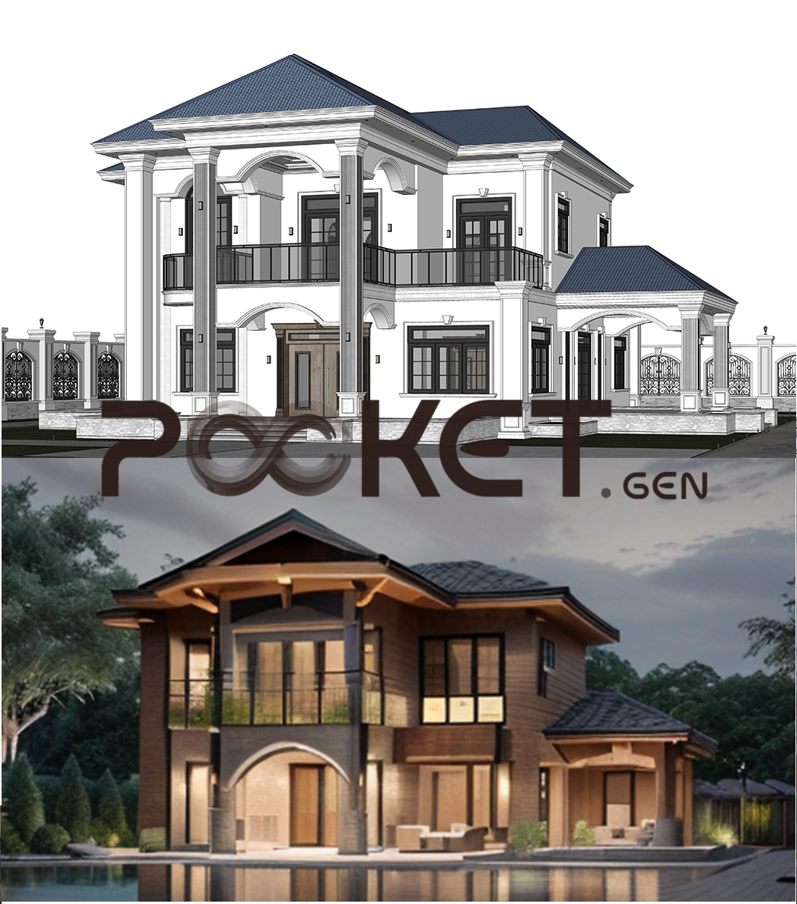

# Pocket-Gen


Pocket-Gen is a prompt generator application using Python, Flet library, and Ollama LLM. This tool helps users generate and manage prompts efficiently.

## Project Structure
```sh
pocket-gen/
├── init.py
├── assets/
│ ├── fonts/
│ │ ├── alfont_com_SFProAR_semibold.ttf
│ │ └── SF-Pro-Text-Medium.otf
│ └── icons/
│ └── Asset.png
├── file.py
├── Logic/
│ ├── init.py
│ └── llm_logic.py
├── main.py
├── Model_Create/
│ ├── init.py
│ └── model_create.py
├── README.md
├── requirements.txt
├── strings_/
│ ├── init.py
│ └── strings.py
└── views/
├── image2txt_view.py
└── text2text_view.py
```

## Prerequisites

- Python 3.10 or higher
- [Ollama](https://ollama.org) installed on your machine
- Llava and Llama2 LLM models installed

## Installation

To get started with Pocket-Gen, follow these steps:

1. **Clone the repository**:
    ```sh
    git clone https://github.com/yourusername/pocket-gen.git
    cd pocket-gen
    ```

2. **Create a virtual environment** (optional but recommended):
    ```sh
    python -m venv venv
    source venv/bin/activate  # On Windows use `venv\Scripts\activate`
    ```

3. **Install the required dependencies**:
    ```sh
    pip install -r requirements.txt
    ```

4. **Install Ollama**:
    Follow the instructions on the [Ollama website](https://ollama.org) to install Ollama on your machine.

5. **Install Llava and Llama2 LLM models**:
    Follow the documentation for Llava and Llama2 to install these models on your machine.

6. **Configure the app models**:
    Run the `create_model.py` script to configure the models for the application:
    ```sh
    python Model_Create/model_create.py
    ```

## Usage

After installing the dependencies and configuring the models, you can run the application using:

```sh
flet run
```
## Screenshots



## Examples ( pocket-gen & stable diffusion & controlnet) :





## Main Function

The `main.py` script sets up a graphical user interface for the Pocket-Gen application using the Flet library. The main features include:

- **Window Settings**: Custom window settings such as size, padding, and always-on-top.
- **Routing**: Handles routing between different views (`/text_prompt` and `/image2txt`).
- **Custom Fonts**: Uses custom fonts located in the `assets/fonts` directory.
- **Views**: Loads views from the `views` directory.

## Directory Breakdown

- **assets/**: Contains font files and icons used in the application.
- **Logic/**: Contains the core logic for the LLM operations.
- **Model_Create/**: Contains scripts for creating models.
- **strings_/**: Contains string management scripts.
- **views/**: Contains the view components for different parts of the application.

## Configuration

Ensure that all dependencies are installed as per the `requirements.txt` file. Additionally, make sure that Ollama, Llava, and Llama2 LLM models are installed and configured properly.

## Contributing

If you would like to contribute to this project, please follow these steps:

1. Fork the repository.
2. Create a new branch (`git checkout -b feature-foo`).
3. Commit your changes (`git commit -am 'Add feature foo'`).
4. Push to the branch (`git push origin feature-foo`).
5. Create a new Pull Request.

## License

This project is licensed under the MIT License. See the [LICENSE](LICENSE) file for more details.

## Contact

If you have any questions or feedback, feel free to contact me at [Ashour@Ashour.live](mailto:Ashour@ashour.live).

## Acknowledgements

- Thanks to the contributors of the Flet library and Ollama LLM.

